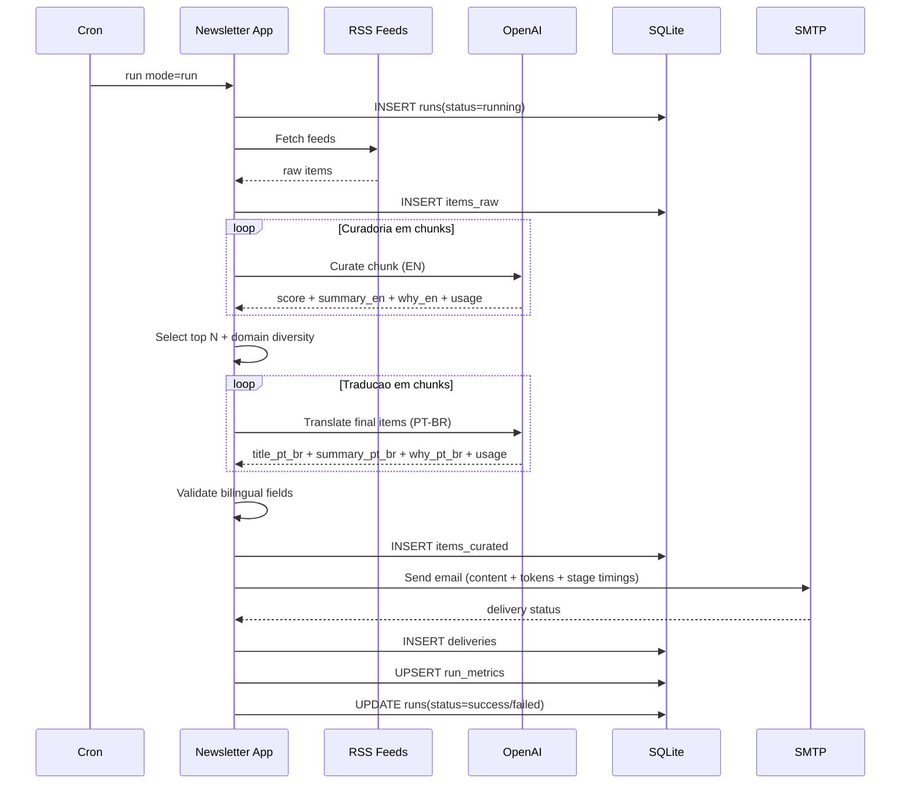
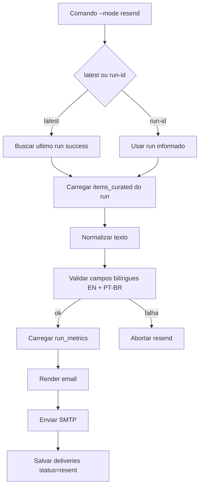

# kaffe-letter (Go)


Newsletter diaria em PT-BR com curadoria por IA (`gpt-5-nano` por padrao), baseada em feeds RSS, com envio por e-mail e opcionalmente Telegram.

## Stack
- Go 1.22
- SQLite (persistência local)
- OpenAI Chat Completions API
- SMTP para envio
- Telegram Bot API (opcional)
- Docker (arm64 para Raspberry Pi 5)

## Como rodar localmente
1. Opcionalmente copie `.env.example` para `.env` se quiser mudar `DATABASE_PATH` ou `SERVER_ADDR`.
2. Execute:

```bash
go mod tidy
go run ./cmd/newsletter
```

## Painel Admin
Para subir o admin self-hosted:

```bash
go run ./cmd/newsletter --mode server
```

O painel usa Go + HTML templates + HTMX e grava parametros no SQLite em `app_settings`.
Os templates do admin ficam separados em `internal/webadmin/templates/admin.html` e sao embutidos no binario via `embed`.
Os segredos também ficam no SQLite, criptografados com AES-GCM. A chave local do app é gerada automaticamente em `data/master.key`.

Parametros editoriais e operacionais passam a ser geridos pelo painel:
- feeds RSS
- quotas e chunk size
- pesos de curadoria
- assunto, timezone e timeout
- SMTP host/user/from
- OpenAI API key
- SMTP password
- destinatarios de email
- Telegram bot token
- chat IDs e flags do Telegram

## Reenvio manual
- Reenviar última execução com sucesso:
```bash
go run ./cmd/newsletter --mode resend --latest
```
- Reenviar `run_id` específico:
```bash
go run ./cmd/newsletter --mode resend --run-id 12
```

## Como rodar com Docker
```bash
docker compose build
docker compose run --rm newsletter
```

## Cron diário (08:00 da manhã)
Exemplo no host (Raspberry Pi):

```cron
0 8 * * * cd /caminho/kaffe-letter && /usr/bin/docker compose run --rm newsletter >> ./logs/cron.log 2>&1
```

## Variáveis principais
- `DATABASE_PATH`
- `SERVER_ADDR`
- `LOG_LEVEL`

O projeto não depende mais de `.env` para segredos ou configuração editorial.

## Visão Macro
1. **Ingestão RSS**:
coleta múltiplos feeds, normaliza URL e remove duplicados.
2. **Pré-filtro determinístico**:
aplica score inicial por domínio/keywords e reduz para `CANDIDATE_POOL_SIZE`.
3. **Curadoria IA (EN) em chunks**:
chamadas em lote (`CURATION_CHUNK_SIZE`) para gerar score e resumo em inglês.
4. **Seleção editorial final**:
ordena por score, aplica diversidade por domínio e corta para `CURATED_ITEMS_COUNT`.
5. **Tradução IA (PT-BR) em chunks**:
traduz título, resumo e “por que importa” dos itens finais.
6. **Validação bilíngue obrigatória**:
só prossegue se cada item tiver campos EN + PT-BR preenchidos.
7. **Persistência + envio**:
salva no SQLite, renderiza HTML/texto, envia por SMTP e opcionalmente Telegram.

## Estratégia Atual
- **Sem fallback de idioma**:
se curadoria/tradução falhar, a execução falha e não envia.
- **Reenvio (`resend`) sem IA**:
usa exclusivamente o conteúdo já salvo no SQLite.
- **Bilíngue persistido**:
cada item final guarda versão EN e PT-BR.
- **Imagens por notícia (quando disponíveis)**:
extraídas de `media:content`/`media:thumbnail`, `enclosure` ou `` na descrição/conteúdo do RSS.

## Gargalo Esperado
- O maior custo de tempo tende a estar em `curation_ms`:
é a etapa com mais chamadas/volume de tokens (pool maior + chunks sequenciais).
- `translation_ms` costuma ser menor porque roda apenas sobre os itens finais.

## Métricas de execução
- Cada execução persiste tempos por etapa em `run_metrics`:
  - `rss_ms`, `curation_ms`, `translation_ms`, `normalize_ms`, `persist_ms`, `render_ms`, `send_ms`, `total_ms`
- Esses tempos também são exibidos no e-mail em tabela.

## Estrutura de Dados (SQLite)
- `runs`: status de cada execução (`running/success/failed`) e timestamps.
- `items_raw`: itens coletados dos feeds (normalizados e deduplicados por `item_hash`).
- `items_curated`: itens finais da newsletter com campos EN + PT-BR.
- `deliveries`: histórico de envio/reenvio por execução.
- `run_metrics`: tempos por etapa para observabilidade operacional.
- `app_settings`: configuração persistida do painel admin.
- `data/master.key`: chave local usada para criptografar os segredos persistidos.

## Diagrama: Arquitetura (Macro)

```mermaid
flowchart LR
    A[Cron / Execucao Manual] --> B[App Go cmd/newsletter]
    B --> C[RSS Collector]
    C --> D[Pre-filtro e Dedupe]
    D --> E[Curadoria IA em Chunks EN]
    E --> F[Selecao Final Top N]
    F --> G[Traducao IA em Chunks PT-BR]
    G --> H[Validacao Bilingue]
    H --> I[(SQLite)]
    H --> J[Renderer HTML/TXT]
    J --> K[SMTP]
    K --> L[Destinatarios]
    I --> M[Resend]
    M --> J
```


## Diagrama: Sequencia (Execucao Diaria)


## Diagrama: Fluxo de Reenvio

