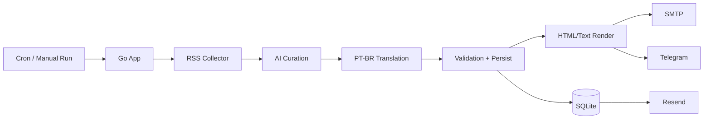

# kaffe-letter


`kaffe-letter` is a self-hosted RSS newsletter engine with AI curation, bilingual output and daily delivery by email, with optional Telegram support.

## What It Does
- Feeds: Ingests RSS feeds chosen and assigned by the user into configurable editorial buckets.
- AI: Curates stories with OpenAI and generates PT-BR + EN content.
- Delivery: Sends a daily digest by SMTP and optionally Telegram.
- Storage: Persists runs, items, metrics and settings locally in SQLite.
- Observability: Includes token usage and per-step timing in the generated email.
- Admin: Exposes an admin panel for self-hosted configuration.

## Engine Controls
These editorial controls shape the curation engine, not credentials:
- 🎯 Candidate pool before AI curation.
- 🧺 Final issue size after ranking and selection.
- 🧩 Chunk size used for AI calls.
- 🚦 Feed-level and total ingestion limits.
- 🌐 Per-domain diversity limits.
- ⚖️ Weighting between relevance, novelty, credibility and target match.
- 🔎 Target domains and keywords used to bias selection.
- 🚫 Blocked domains to keep out unwanted sources.

Feed buckets and quotas are user-managed in the admin UI, so the editorial shape of the newsletter can be changed without touching code.

## Screenshots
Admin panel:


## Quick Start
```bash
go run ./cmd/newsletter
```

To run the admin panel:
```bash
go run ./cmd/newsletter --mode server
```

To build and run with Docker:
```bash
docker compose build
docker compose run --rm newsletter
```

## Configuration
The app uses environment variables for bootstrap and SQLite/admin as the source of truth after the first boot.

Bootstrap variables:
- `DATABASE_PATH`
- `SERVER_ADDR`
- `LOG_LEVEL`
- `TIMEZONE`
- `HTTP_TIMEOUT_SECONDS`
- `OPENAI_MODEL`
- `OPENAI_API_KEY`
- `SMTP_HOST`
- `SMTP_PORT`
- `SMTP_USER`
- `SMTP_PASS`
- `EMAIL_FROM`
- `EMAIL_TO`
- `EMAIL_SUBJECT`
- `TELEGRAM_ENABLED`
- `TELEGRAM_BOT_TOKEN`
- `TELEGRAM_CHAT_IDS`
- `TELEGRAM_DISABLE_WEB_PREVIEW`

Notes:
- `.env` is optional and useful for local or headless bootstrap.
- Sensitive values are encrypted before being written to SQLite.
- The local master key is stored at `data/master.key`.
- Editorial settings and feed buckets are managed in the admin after bootstrap.

## Runtime Modes
- `run`: executes the daily newsletter pipeline.
- `server`: starts the admin UI.
- `resend`: re-sends a previously generated edition without calling AI.

Examples:
```bash
go run ./cmd/newsletter --mode resend --latest
go run ./cmd/newsletter --mode resend --run-id 12
```

## Architecture


## Observability
- Each run stores token usage and timing metrics per step in `run_metrics`.
- The generated email includes a compact table with tokens consumed and time spent per stage.
- The admin dashboard shows the latest runs, current execution state and status progression.

## Project Layout
- `cmd/newsletter`: CLI entrypoint.
- `internal/config`: runtime config and persisted settings.
- `internal/curation`: OpenAI calls and editorial scoring.
- `internal/email`: SMTP delivery.
- `internal/render`: HTML and text rendering.
- `internal/rss`: feed collection and normalization.
- `internal/store`: SQLite schema and persistence.
- `internal/webadmin`: self-hosted admin UI.

## Open Source Notes
- The project is designed to be self-hosted.
- Feed lists, quotas and delivery settings are editable from the admin UI.
- Re-send reuses stored content, so it does not require a second AI pass.
- The repo should not contain production secrets or database files.

## Contributing
See [CONTRIBUTING.md](CONTRIBUTING.md) for local development and pull request expectations.

## Security
See [SECURITY.md](SECURITY.md) for secret handling and vulnerability reporting.

## License
This project is licensed under the [MIT License](LICENSE).
