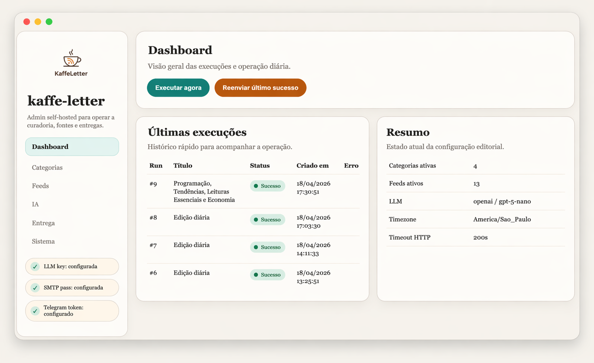
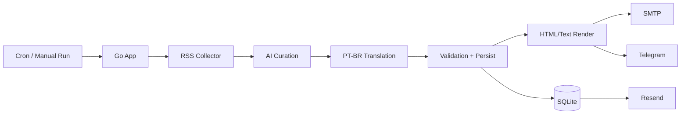

# kaffe-letter


`kaffe-letter` is an open-source, self-hosted RSS newsletter engine with AI curation, bilingual output and daily delivery by **email**, with optional **Telegram support**.

## What It Does

- Feeds: Ingests RSS feeds chosen and assigned by the user into configurable editorial buckets.
- AI: Curates stories with a configurable LLM provider and generates PT-BR + EN content.
- Delivery: Sends a daily digest by SMTP and optionally Telegram.
- Storage: Persists runs, items, metrics and settings locally in SQLite.
- Observability: Includes token usage and per-step timing in the generated email.
- Admin: Exposes an admin panel for self-hosted configuration.

## Engine Controls

These editorial controls shape the curation engine

- 🎯 Candidate pool before AI curation.
- 🧺 Final issue size after ranking and selection.
- 🧩 Chunk size used for AI calls.
- 🚦 Feed-level and total ingestion limits.
- 🌐 Per-domain diversity limits.
- ⚖️ Weighting between relevance, novelty, credibility and target match.
- 🔎 Target domains and keywords used to bias selection.
- 🚫 Blocked domains to keep out unwanted sources.

Feed buckets and quotas are user-managed in the admin UI, so the editorial shape of the newsletter can be changed without touching code.

## Screenshots

Admin panel:



## Quick Start

```bash
go run ./cmd/newsletter
```

To run the admin panel:

```bash
go run ./cmd/newsletter --mode server
```

To build and run with Docker:

```bash
docker compose up -d
```

## Containers

`kaffe-letter` is designed to run cleanly in containers:

- `Dockerfile` builds a small Go binary for the application.
- `docker-compose.yml` is the recommended self-hosted entrypoint for local and production-like runs.
- `.env` is optional and only used if you want bootstrap values in a file.
- The default container command is `server`, so `docker compose up -d` starts the admin UI and the built-in daily scheduler.
- The admin UI is exposed on port `8080` by default.
- The app persists state in SQLite, so the container only needs a persistent Docker volume.
- `DELIVERY_TIME` controls the daily delivery window used by the built-in scheduler.

## Configuration

There are two ways to bootstrap `kaffe-letter`:

- via the web UI, which persists settings in SQLite
- via an `.env` file, which is optional and useful for headless or first-run setup

Optional bootstrap variables:

| Variable                       | Purpose                                               | Notes                                              |
| ------------------------------ | ----------------------------------------------------- | -------------------------------------------------- |
| `DATABASE_PATH`                | SQLite file location                                  | Defaults to `./data/newsletter.db`                 |
| `SERVER_ADDR`                  | Admin server bind address                             | Defaults to `:8080`                                |
| `LOG_LEVEL`                    | Runtime logging level                                 | Defaults to `info`                                 |
| `TIMEZONE`                     | Newsletter scheduling timezone                        | Defaults to `America/Sao_Paulo`                    |
| `DELIVERY_TIME`                | Daily delivery time in the chosen timezone           | Defaults to `07:00`                                |
| `HTTP_TIMEOUT_SECONDS`         | Timeout for feeds and LLM calls                       | Defaults to `20`                                   |
| `LLM_PROVIDER`                 | LLM backend selector                                  | Accepts `openai`, `anthropic`, `gemini` or `local` |
| `LLM_MODEL`                    | Model name                                            | Example: `gpt-5-nano`                              |
| `LLM_BASE_URL`                 | Custom endpoint for local/OpenAI-compatible providers | Mostly useful for `local`                          |
| `LLM_API_KEY`                  | LLM credential                                        | Optional for some local setups                     |
| `SMTP_HOST`                    | SMTP server hostname                                  | Required only if you use email delivery            |
| `SMTP_PORT`                    | SMTP server port                                      | Required only if you use email delivery            |
| `SMTP_USER`                    | SMTP username                                         | Required only if you use email delivery            |
| `SMTP_PASS`                    | SMTP password                                         | Sensitive value, encrypted in SQLite               |
| `EMAIL_FROM`                   | Sender email address                                  | Required only if you use email delivery            |
| `EMAIL_TO`                     | Newsletter recipients                                 | One or more addresses                              |
| `EMAIL_SUBJECT`                | Email subject template                                | Defaults to a daily newsletter subject             |
| `TELEGRAM_ENABLED`             | Telegram delivery toggle                              | `true` or `false`                                  |
| `TELEGRAM_BOT_TOKEN`           | Telegram bot credential                               | Sensitive value, encrypted in SQLite               |
| `TELEGRAM_CHAT_IDS`            | Telegram destinations                                 | One or more chat IDs                               |
| `TELEGRAM_DISABLE_WEB_PREVIEW` | Disable link previews in Telegram                     | Defaults to `true`                                 |

Notes:

- `.env` is optional and useful for local or headless bootstrap.
- You can also start directly from the admin UI and let SQLite become the source of truth after the first boot.
- Sensitive values are encrypted before being written to SQLite.
- The local master key is stored at `data/master.key`.
- Editorial settings and feed buckets are managed in the admin after bootstrap.

## Runtime Modes

- `run`: executes the daily newsletter pipeline.
- `server`: starts the admin UI and the built-in daily scheduler.
- `resend`: re-sends a previously generated edition without calling AI.

Examples:

```bash
go run ./cmd/newsletter --mode resend --latest
go run ./cmd/newsletter --mode resend --run-id 12
```

## Architecture



## Observability

- Each run stores token usage and timing metrics per step in `run_metrics`.
- The generated email includes a compact table with tokens consumed and time spent per stage.
- The admin dashboard shows the latest runs, current execution state and status progression.

## Project Layout

- `cmd/newsletter`: CLI entrypoint.
- `internal/config`: runtime config and persisted settings.
- `internal/curation`: LLM calls and editorial scoring.
- `internal/email`: SMTP delivery.
- `internal/render`: HTML and text rendering.
- `internal/rss`: feed collection and normalization.
- `internal/store`: SQLite schema and persistence.
- `internal/webadmin`: self-hosted admin UI.

## Open Source Notes

- The project is designed to be self-hosted.
- Feed lists, quotas and delivery settings are editable from the admin UI.
- Re-send reuses stored content, so it does not require a second AI pass.
- The repo should not contain production secrets or database files.

## Contributing

See [CONTRIBUTING.md](CONTRIBUTING.md) for local development and pull request expectations.

## Security

See [SECURITY.md](SECURITY.md) for secret handling and vulnerability reporting.

## License

This project is licensed under the [MIT License](LICENSE).
